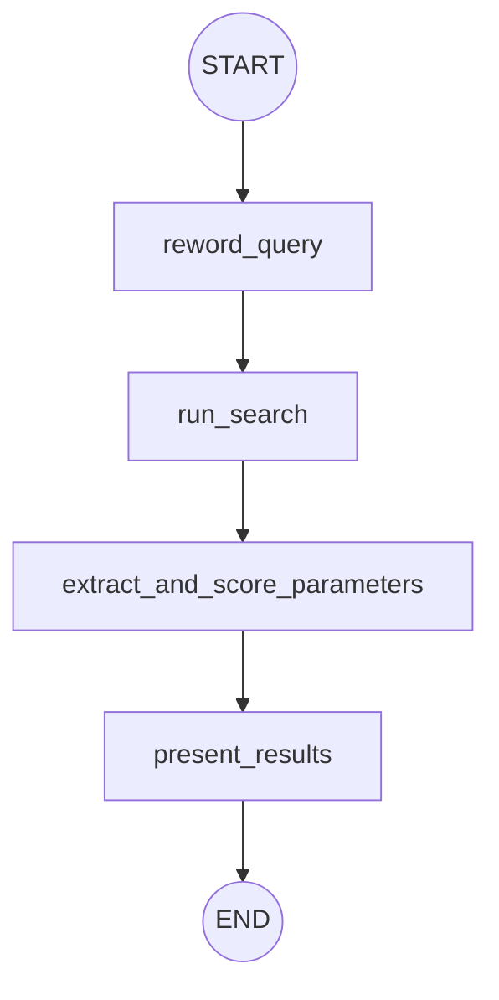

Data-driven probability assestment agent.

Current workflow

```mermaid
	graph TD
	%% Nodes
	START((START))
	END((END))
	reword_query[reword_query]
	run_search[run_search]
	extract_and_score_parameters[extract_and_score_parameters]
	present_results[present_results]

	%% Edges
	START --> reword_query
	reword_query --> run_search
	run_search --> extract_and_score_parameters
	extract_and_score_parameters --> present_results
	present_results --> END
```