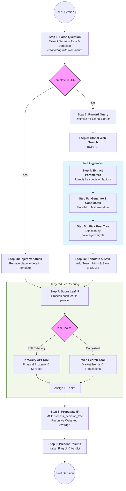

Data-driven probability assestment agent.

## Current workflow

## Tree Generation
The agent searches the web for key decision-making factors, builds the tree, assigns scores to the leaves, and propagates the weighted average up through the intermediate layers to the root node.

Example: "Is opening a restaurant in Via Calzaiuoli 50 in Florence a good idea?"

```mermaid
graph TD
    %% Root Node
    root["<b>Root:</b> Is opening a restaurant in {address} a good idea?<br/><i>(Weight: 1.0)</i>"]

    %% Group 1: Location & Market
    root --> group_loc["<b>Group:</b> Location & Market Potential<br/><i>(Weight: 0.5)</i>"]
    group_loc --> leaf_foot["<b>Leaf:</b> High Foot Traffic<br/><i>(Weight: 0.3)</i>"]
    group_loc --> leaf_tour["<b>Leaf:</b> Tourist Appeal & Volume<br/><i>(Weight: 0.3)</i>"]
    group_loc --> leaf_econ["<b>Leaf:</b> Economic Activity<br/><i>(Weight: 0.2)</i>"]
    group_loc --> leaf_hist["<b>Leaf:</b> Location Type Historic/Cultural<br/><i>(Weight: 0.1)</i>"]
    group_loc --> leaf_social["<b>Leaf:</b> Commercial Hubs/Social Condensers<br/><i>(Weight: 0.1)</i>"]

    %% Group 2: Business Viability
    root --> group_viab["<b>Group:</b> Industry & Business Viability<br/><i>(Weight: 0.3)</i>"]
    group_viab --> leaf_rest_viab["<b>Leaf:</b> Location Viability for Restaurant<br/><i>(Weight: 0.7)</i>"]
    group_viab --> leaf_horeca["<b>Leaf:</b> Horeca Sector Outlook<br/><i>(Weight: 0.3)</i>"]

    %% Group 3: Challenges & Competition
    root --> group_chal["<b>Group:</b> Potential Challenges & Competition<br/><i>(Weight: 0.2)</i>"]
    group_chal --> leaf_comp["<b>Leaf:</b> Existing Competition at {address}<br/><i>(Weight: 0.6)</i>"]
    group_chal --> leaf_tourism_impact["<b>Leaf:</b> Impact of Mass Tourism on Identity<br/><i>(Weight: 0.4)</i>"]

    %% Styling
    style root fill:#f9f,stroke:#333,stroke-width:2px
    style group_loc fill:#bbf,stroke:#333,stroke-width:1px
    style group_viab fill:#bbf,stroke:#333,stroke-width:1px
    style group_chal fill:#bbf,stroke:#333,stroke-width:1px
    
    classDef leafNode fill:#fff,stroke:#999,stroke-dasharray: 5 5
    class leaf_foot,leaf_tour,leaf_econ,leaf_hist,leaf_social,leaf_rest_viab,leaf_horeca,leaf_comp,leaf_tourism_impact leafNode
```

